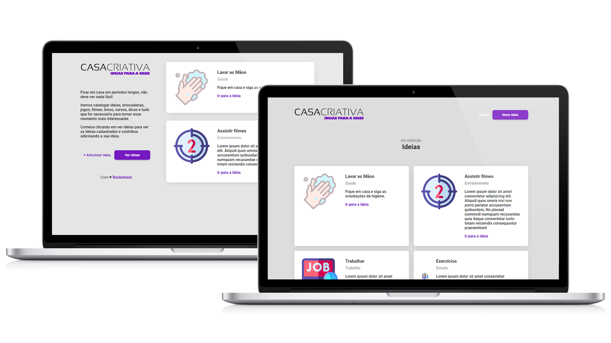

<p align="center">
  
</p>

<p align="center">
  <a href="#exemplo">Exemplo</a>&nbsp;&nbsp;&nbsp;|&nbsp;&nbsp;&nbsp;
  <a href="#dependências">Dependências</a>&nbsp;&nbsp;&nbsp;|&nbsp;&nbsp;&nbsp;
  <a href="#como-editar-o-projeto">Como editar o projeto</a>&nbsp;&nbsp;&nbsp;|&nbsp;&nbsp;&nbsp;
  <a href="#scripts">Scripts</a>&nbsp;&nbsp;&nbsp;|&nbsp;&nbsp;&nbsp;
</p>

# CasaCriativa
Plataforma para contribuir com ideias de atividades para fazer durante o isolamento social.

## Exemplo

<p align="center">
  
</p>

## Dependências

- [Express](https://expressjs.com/pt-br/)
- [Nunjucks](https://mozilla.github.io/nunjucks/)
- [SQLite](https://www.sqlite.org/index.html)

## Como editar o projeto

```bash
  # Clone esse repositório
  $ git clone https://github.com/valois-git/CasaCriativa CasaCriativa

  # Acesse a pasta criada
  $ cd CasaCriativa

  # Instale as dependências
  $ npm install
```

## Scripts

```bash
  $ npm start # Inicia o servidor local

  $ npm run dev # Inicia o projeto no servidor local, mas escutando alterações, utilizado no desenvolvimento
```